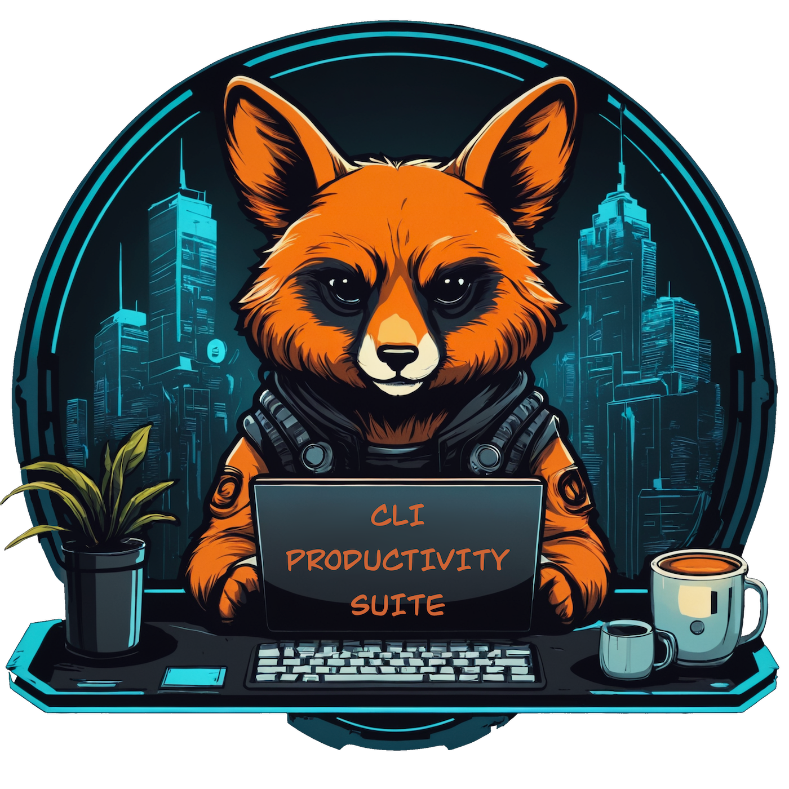

<div align="center">


    
# Command Line Productivity Suite
</div>

* [Introduction](#introduction)
* [Installation](#installation)
* [Post Installation Steps](#post-installation-steps)
* [Bonus Tips](#bonus-tips)

## Introduction

As a non-standard way of managing and installing dotfiles, I use this repo to easily install a cool and funky shell experience along with an awesome `neovim` and `tmux` (also with cool and funky config). This repo also carries Linux and MacOS config files for the `Kitty` terminal (I recommend running Kitty with this suite). Overall, I also recommend using the [Catppuccin](https://catppuccin-website.vercel.app/) theme.

Before installing the suite, install the Catppuccin theme with `Mocha` configuration for your terminal. Then, install a `nerd` font (I recommend [JetBrains Mono Nerd Font](https://github.com/ryanoasis/nerd-fonts/releases/download/v3.2.1/JetBrainsMono.zip)).

*This suite has been tested on and works for Debian & MacOS. (PS: MacOS requires `brew` to be installed.)*

## Installation

First, install the basic tools &rarr;

```bash
# Linux
sudo apt install git zsh wget curl

# MacOS
brew install git zsh wget curl
```

Next, install *oh my zsh* as follows &rarr;

```bash
wget https://raw.githubusercontent.com/ohmyzsh/ohmyzsh/master/tools/install.sh 2>/dev/null && sh install.sh
# after installtion completes and you're in new shell, clearup by running - rm install.sh
```

Next, execute the suite script using the direct command below to install all the other magic. You will need to enter the password whenever prompted.

```bash
# Linux
sh -c "$(curl -fsSL https://raw.githubusercontent.com/Tanq16/cli-productivity-suite/master/install_zsh_linux.sh)"

# MacOS
sh -c "$(curl -fsSL https://raw.githubusercontent.com/Tanq16/cli-productivity-suite/master/install_zsh_macos.sh)"
```

Finally, close the shell ***completely*** (close the terminal app or end the SSH session) and start a new instance.

## Post Installation Steps

- `tmux` is installed by default in the suite. Use `tt` to launch a default session. Check config for more commands
- `bat`, an alternative of `cat` with colored output is also installed by default
- `aerospace` (only for MacOS) is also installed, but needs a couple extra steps &rarr;
    - Refer to bonus tips section below for some config tips
    - Create a file at `$HOME/.aerospace.toml` and add the contents of `macos.aerospaceconf` from this repo to that file
    - Start the app and allow the accessibility settings requested by it
    - Modify the config as needed and apply by pressing `⌥+⬆+;` followed by `escape` key
- `nvim` is installed with ***NvChad*** configuration, but `nvim` needs a few small steps to get up and running smoothly &rarr;
    - First, run the Vim command `:MasonInstallAll`
    - Next, run Vim command `:Lazy sync` and exit
    - Start `nvim` once again and run `:MasonInstallAll`
    - NeoVim doesn't allow setting a theme while headless, so use `<space>+th` and select `catppuccin` to match the colorshceme with everything else

***PS:*** `bat` has pager enabled by default, which I disable in the shell rc-file using `export BAT_PAGER=''`. To re-enable, delete that line in `.zshrc`.

## Bonus Tips

A handy shortcut in `tmux` that I added is `Alt + \` to split into two vertical panes and `Alt + Shift + \` to split into two horizontal panes. Focus can be navigated among the split panes by using `Shift + <arrow keys>`.

Pasting on a modified `zsh` shell can be slow due to magic functions in `oh-my-zsh`. I fixed this in the suite by commenting those functions in `~/.oh-my.zsh/lib/misc.zsh`. If you need to re-enable these, uninstall the suite, restart your terminal and comment the necessary `sed` lines in the scripts before re-installing.

If something goes wrong or you you want to re-install, you can uninstall the suite using command below. Then, start from scratch again &rarr;

```bash
rm -rf $HOME/.oh-my-zsh $HOME/.fzf $HOME/.fzf.zsh $HOME/.tmux $HOME/.tmux.conf $HOME/.tmux-themepack $HOME/.vimrc $HOME/.viminfo $HOME/.vim $HOME/.config/nvim $HOME/.local/share/nvim $HOME/.zshrc
```

I like to disable all Keyboard shortcuts in MacOS except for screenshots. Additionally, I keep the following settings for some other configurations &rarr;

- `Only in Stage Manager` - Click wallpaper to reveal desktop
- `Off` - Automatically rearrange Spaces based on most recent use
- `Off` - When switching an application, switch to a Space with open windows for the application
- `On` - Group windows by application
- `On` - Displays have separate Spaces
