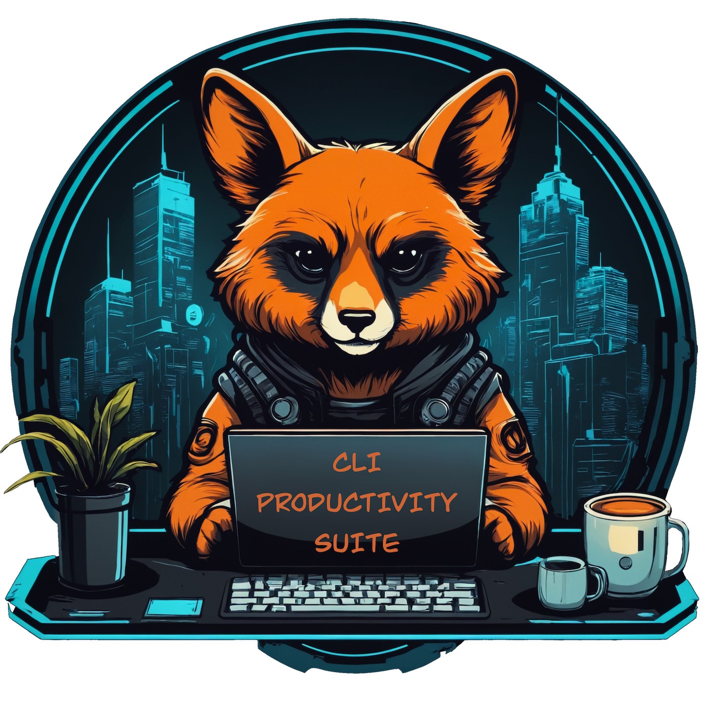

<div align="center">
  
  <h1>CLI Productivity Suite</h1>

  <a href="https://github.com/tanq16/cli-productivity-suite/actions/workflows/release.yaml"></a>&nbsp;<a href="https://github.com/tanq16/cli-productivity-suite/releases"></a><br><br>
  <a href="#capabilities">Capabilities</a> &bull; <a href="#installation">Installation</a> &bull; <a href="#usage">Usage</a> &bull; <a href="#tips-and-notes">Tips & Notes</a> &bull; <a href="#deep-removal">Deep Removal</a>
</div>

---

A single Go binary (`cps`) to initialize, manage, and update a complete CLI-driven development environment on Linux and macOS. It installs and tracks ~50 tools across these categories:

- **CLI utilities** - bat, fd, ripgrep, lsd, jq, yq, fzf, gron, sq, and more
- **Security tools** - nuclei, naabu, katana, subfinder, ffuf, gobuster, trufflehog, proxify
- **Cloud & infra** - AWS CLI, Azure CLI, gcloud CLI, terraform, kubectl, kubelogin
- **Language runtimes** - Go SDK, Python 3.14 (via uv), Rust (via rustup), Node.js LTS (via nvm)
- **Editor & shell** - Neovim (0.11+) with NvChad, spaceship-prompt, zsh plugins, tmux with TPM
- **Config files** - complete `.zshrc`, tmux.conf, kitty.conf, aerospace.toml (macOS)

## Capabilities

| Category | Commands | Description |
|----------|----------|-------------|
| Setup | `cps init` | Full environment setup - system packages, ~50 tools, cloud CLIs, language runtimes, shell plugins, and config files |
| Monitoring | `cps check` | Compare installed versions against latest releases |
| Install | `cps install <tools\|categories>...` | Install or update tools by name or category |
| Self-update | `cps self-update` | Update cps itself to the latest release |
| Maintenance | `cps clean` | Remove all CPS-managed files and directories |

## Installation

### Binary

Download from [releases](https://github.com/tanq16/cli-productivity-suite/releases):

```bash
# Linux/macOS
ARCH=$(uname -m); [ "$ARCH" = "x86_64" ] && ARCH=amd64; [ "$ARCH" = "aarch64" ] && ARCH=arm64
curl -sL https://github.com/tanq16/cli-productivity-suite/releases/latest/download/cps-$(uname -s | tr '[:upper:]' '[:lower:]')-$ARCH -o cps
chmod +x cps
sudo mv cps /usr/local/bin/
```

### Build from Source

```bash
git clone https://github.com/tanq16/cli-productivity-suite
cd cli-productivity-suite
make build
```

### Prerequisites

- [Oh My Zsh](https://ohmyz.sh/) must be installed before running `cps init`
- Git must be available in PATH
- **macOS only:** [Homebrew](https://brew.sh/) must be installed for system package installation
- Install a nerd font for your terminal emulator - recommended: [JetBrains Mono Nerd Font](https://github.com/ryanoasis/nerd-fonts/releases/download/v3.0.2/JetBrainsMono.zip)

## Usage

### `init`

Full environment setup with all tools, plugins, and configs.

```bash
# Public tools only
cps init

# Include private repos
cps init --gh-token YOUR_GITHUB_PAT
```

### `check`

Compare installed tool versions against latest releases. Only shows actionable items (tools needing update, config diffs, errors). Private tools are automatically included when a GitHub token is available.

```bash
cps check
cps check --skip-private    # Skip private tools even with token
```

### `install`

Install or update tools by name or category. Accepts multiple arguments. When a single tool is specified, it shows a single-line result. When multiple tools or categories are specified, it runs as a batch with phase output.

```bash
cps install bat                     # Single tool
cps install bat fd ripgrep          # Multiple tools
cps install public                  # All public tools
cps install configs                 # Config files + shell plugins
cps install --gh-token TOKEN gcli   # Private tool with token
```

**Category aliases:**

| Alias | What it installs |
|-------|-----------------|
| `public` | All public GitHub release binaries, direct downloads, and own public tools |
| `private` | Private tools (requires `--gh-token`) |
| `system` | System packages via apt (Linux) or brew (macOS) |
| `cloud` | Cloud CLIs (AWS, Azure, gcloud) |
| `runtimes` | Language runtimes (Go, Python, Rust, Neovim) |
| `configs` | Config files (.zshrc, tmux, kitty, aerospace) and shell plugins (spaceship, zsh plugins, tpm, nvchad, nvm) |

### `self-update`

Update cps itself to the latest release (requires sudo).

```bash
cps self-update
```

### `clean`

Remove all CPS-managed files and directories with confirmation.

```bash
cps clean
```

**Global flags:**

| Flag | Description |
|------|-------------|
| `--debug` | Enable debug logging |
| `--for-ai` | AI-friendly output (markdown tables, no color) |
| `--gh-token` | GitHub PAT for private repos (falls back to `gh auth token`) |

## Tips and Notes

- All binary tools are installed to `~/shell/executables/` - automatically added to your PATH in `.zshrc`
- Neovim is installed from GitHub releases (0.11+) on both Linux and macOS to meet NvChad requirements
- State is tracked in `~/.config/cps/state.json` - this file records installed versions for `check` and `install` commands
- If the `gh` CLI is authenticated (`gh auth login`), CPS automatically uses its token - no need to pass `--gh-token`
- Running `cps init` is idempotent - it skips tools that are already at the latest version
- Cloud CLIs (AWS, Azure, gcloud) require sudo on Linux for system-level installation
- The `.zshrc` deployed by `cps init` is a complete replacement - it includes Oh My Zsh config, tool integrations and aliases
- `cps clean` removes `~/shell`, `~/.tmux`, `~/.config/nvim`, `~/.nvm`, `~/nuclei-templates`, `~/google-cloud-sdk`, and `~/.config/cps` - it does not touch Oh My Zsh, deployed config files, or system packages
- If you previously had `bat` installed and it is somehow quite slow now to load, it's likely due to an outdated cache, which can be rebuilt with `bat cache --build`

## Deep Removal

The `cps clean` command performs a superficial cleanup of CPS-managed directories. For a full removal of everything CPS installs, follow these steps:

**Step 1** - Run `cps clean` to remove the primary managed directories (`~/shell`, `~/.tmux`, `~/.config/nvim`, `~/.nvm`, `~/nuclei-templates`, `~/google-cloud-sdk`, `~/.config/cps`):

```bash
cps clean
```

**Step 2** - Remove remaining configs, data directories, Oh My Zsh, and system-level installs:

```bash
rm -rf \
  $HOME/.oh-my-zsh \
  $HOME/.tmux.conf \
  $HOME/.zshrc \
  $HOME/.aerospace.toml \
  $HOME/.config/kitty/kitty.conf \
  $HOME/.local/share/nvim \
  && sudo rm -rf /usr/local/go /usr/local/aws-cli /usr/local/bin/cps
```

**Step 3** - Remove system packages installed by CPS:

Linux (apt):

```bash
sudo apt-get remove -y tmux openssl nmap ncat cmake gcc make ninja-build gettext zip unzip file ffmpeg htop
```

macOS (brew):

```bash
brew uninstall tmux openssl nmap ffmpeg htop
brew uninstall --cask nikitabobko/tap/aerospace
```
