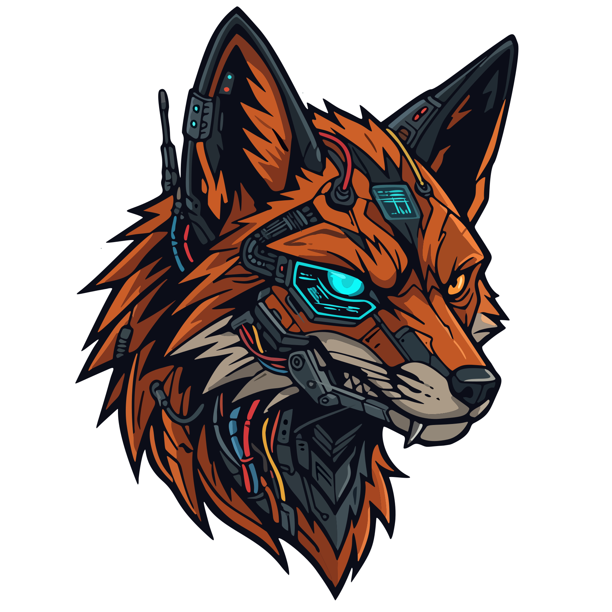

<div align="center">
  
  <h1>CLI Productivity Suite</h1>

  <a href="https://github.com/tanq16/cli-productivity-suite/actions/workflows/release.yaml"></a>&nbsp;<a href="https://github.com/tanq16/cli-productivity-suite/releases"></a><br><br>

  <a href="#capabilities">Capabilities</a> &bull; <a href="#install">Install</a> &bull; <a href="#usage">Usage</a> &bull; <a href="#notes">Notes</a>
</div>

---

A single Go binary (`cps`) that installs and maintains a complete CLI development environment on Linux and macOS: zsh, Neovim, tmux, their configs, and on top of that language runtimes, cloud CLIs, security tooling, and self-hosted services.

It is not a dotfiles manager and not a plugin framework. CPS owns what it installs, all of it under `~/shell/`, and it tracks versions so re-running a command updates rather than reinstalls.

## Capabilities

| Category | Commands | Description |
|---|---|---|
| Environment | `init` | Base setup: zsh plugins, Neovim, tmux, kitty and shell configs |
| Extensions | `extend <pack> [tools...]`, `extend list` | Install a tool pack, or named tools from one |
| Appearance | `theme [name]` | Switch the colour palette across kitty, tmux, Neovim and the CLI tools at once |
| Reference | `cheat <topic>` | Terminal cheat sheets for twelve topics |
| Maintenance | `self-update` | Replace the running `cps` binary with the latest release |

## Install

### Requirements

`cps init` exits immediately unless `git` and Homebrew are both on PATH. On macOS, `git` comes from the Xcode Command Line Tools:

```bash
xcode-select --install
```

On Linux:

```bash
sudo apt install git curl zsh build-essential
```

Then Homebrew, on both platforms, which CPS uses for every system and cloud CLI package:

```bash
/bin/bash -c "$(curl -fsSL https://raw.githubusercontent.com/Homebrew/install/HEAD/install.sh)"
```

[Kitty](https://sw.kovidgoyal.net/kitty/) and a Nerd Font such as [JetBrains Mono](https://www.nerdfonts.com/font-downloads) are recommended rather than required. `cps theme` only writes a kitty palette, and the kitty, tmux and Neovim configs draw glyphs a plain font renders as boxes.

### Binary

```bash
ARCH=$(uname -m); [ "$ARCH" = "x86_64" ] && ARCH=amd64; [ "$ARCH" = "aarch64" ] && ARCH=arm64
mkdir -p "$HOME/.local/bin"
curl -sL "https://github.com/tanq16/cli-productivity-suite/releases/latest/download/cps-$(uname -s | tr '[:upper:]' '[:lower:]')-$ARCH" -o "$HOME/.local/bin/cps"
chmod +x "$HOME/.local/bin/cps"
```

Every release carries `linux` and `darwin` builds for `amd64` and `arm64`. On a fresh macOS `~/.local/bin` is not on PATH yet, so run the first command by full path as `~/.local/bin/cps init`; the rc fragment that `init` deploys adds the directory for every session after that.

### Sandbox container

A prebuilt Ubuntu image with the whole environment already built, for a machine you would rather not install CPS on directly.

```bash
docker run -d --name cps-sandbox tanq16/cps-sandbox:latest
docker exec -it cps-sandbox zsh -l
```

The image runs `sleep infinity`, so it stays up and you `docker exec` into it whenever you need it. It is multi-arch and several GB, since it carries every pack except the two token-gated private tools. [docs/sandbox.md](docs/sandbox.md) covers what is inside, how to build it locally, and how to verify a build.

### From source

Needs Go 1.26.

```bash
git clone https://github.com/tanq16/cli-productivity-suite && cd cli-productivity-suite
make build
```

## Usage

Every command is idempotent. Installed versions are tracked in `~/.config/cps/state.json` and anything already current is skipped, so re-running a command is how you update. Binaries land in `~/shell/extensions/`, which `init` puts on PATH.

Three global flags apply to every command:

| Flag | Description |
|---|---|
| `--gh-token` | GitHub PAT for private repos. Falls back to `gh auth token` when `gh` is authenticated |
| `--debug` | Verbose debug logging |
| `--for-ai` | Markdown tables, no colour. Mutually exclusive with `--debug` |

### First run

```bash
cps init                  # base shell env, zsh plugins, configs, neovim, tmux
cps extend essentials     # everyday CLI binaries (bat, fd, ripgrep, fzf, starship, ...)
cps extend core           # brew packages for build, network and media work
```

Run them in that order. `init` deploys a `.zshrc` that reaches for binaries the `essentials` pack provides, so the starship prompt and aliases like `l`, `la` and `tree` stay unresolved until `essentials` is installed. Everything past those three is optional.

`init` itself installs no CLI binaries. It creates the `~/shell/` tree, installs a handful of brew packages, Neovim, and the two zsh plugins, and deploys the configs. [docs/shell-environment.md](docs/shell-environment.md) covers what those configs do and where to put your own.

### `cps extend <pack> [tools...]`

```bash
cps extend list                       # every pack, its tools, and what it needs
cps extend runtimes                   # the whole pack
cps extend runtimes go-sdk            # one tool from it
cps extend security nuclei subfinder  # several
```

| Pack | Contents |
|---|---|
| `essentials` | bat, fd, ripgrep, lsd, jq, yq, fzf, gh, gron, zoxide, sd, starship, tree-sitter, anbu, danzo, age, sq, and the starship config |
| `core` | Brew packages: nmap, openssl and ffmpeg everywhere, the build toolchain (cmake, gcc, make, ninja, gettext) on Linux, aerospace on macOS |
| `runtimes` | uv, fnm, bun, Go, Eclipse Temurin JDK, Python, Rust, Node LTS, and the gopls, pyright, typescript-language-server and ruff language servers |
| `cloud` | AWS, Azure and gcloud CLIs |
| `security` | nuclei, nuclei-templates, naabu, subfinder, proxify, httpx, dnsx, trufflehog, katana, ffuf, dalfox, gobuster, gau, gowitness |
| `cloudsec` | terraform, tofu, kubectl, kubelogin, grpcurl, trivy, prowler, oci-cli |
| `ai-tools` | antigravity, cursor-agent, claude-code, codex |
| `homelab` | caddy, linksnapper, kairo, raikiri, expenseowl, and the rinnegan, code-server and neo4j app bundles |
| `private` | nits, gcli, box and claudex install as-is; toon and cybernest need `--gh-token` |

`cps extend list` marks `cloudsec`, `ai-tools` and `homelab` as needing `runtimes`, because a few of their tools install through a runtime instead of downloading a binary. The npm-backed ones (`claude-code`, `codex`) also need a shell in which `fnm env` has already run, so open a new shell after installing `runtimes` or the install fails with `npm install <pkg> failed`.

Installing `runtimes`, `cloud`, `security` or `homelab` also deploys that pack's rc fragment.

### `cps theme [name]`

```bash
cps theme                 # list, marking the active one
cps theme gruvbox-dark    # switch
```

Fifteen themes ship embedded, in dark and light pairs where upstream publishes both: `mocha` and `latte` (Catppuccin), `gruvbox`, `dracula`, `tokyonight`, `monokai`, `atom-one`, `everforest`, and `nord-dark`.

Only the kitty palette changes, and everything downstream follows because nothing downstream names a hex colour. The tmux, Neovim and starship configs reference ANSI indices `0-15`, and bat, lsd and fzf are pinned to those same indices rather than the 256-colour cube they otherwise default to. Kitty reloads within a second, running tmux and Neovim sessions pick the palette up on their next redraw, and nothing restarts. The choice is recorded in state, so `cps init` keeps it.

### `cps cheat <topic>`

Cheat sheets for `cps`, `go`, `java`, `uv`, `fnm`, `bun`, `rust`, `tmux`, `nvim`, `fzf`, `jq` and `regex`. `cps cheat list` prints the set with descriptions.

### `cps self-update`

Downloads the latest release and replaces the running binary in place, at whatever path it is running from.

## Notes

- **Binaries and app bundles land in different places.** Single binaries go to `~/shell/extensions/`, which is on PATH. The multi-file trees (rinnegan, code-server, neo4j) unpack to `~/shell/apps/<name>/` and are not on PATH, so you launch them by full path. [docs/app-bundles.md](docs/app-bundles.md) covers running them and where each keeps its data.
- **Your own aliases and binaries have two drop-zones.** `.zsh` files in `~/shell/rc/custom/` are sourced after every CPS fragment, so they can override anything CPS set, and `~/shell/custom-bin/` is prepended to PATH ahead of the CPS-managed directories, so your binary wins a name collision. `cps init` creates both and never touches them again.
- **Snapshot directories are replaced wholesale.** The zsh plugins and `nuclei-templates` are downloaded as tarballs of the default branch with no `.git` at all, and an update swaps the whole directory. Keep nothing of your own in `~/shell/plugins/` or `~/shell/nuclei-templates`; custom nuclei templates belong in a directory of your own that you pass with `-t`.
- **An upgrade can ask for manual steps before it runs.** The first `cps` command after an upgrade compares the version in `state.json` against the binary and prints whatever manual migration the intervening releases need, then asks whether you have run them. Answering no exits without doing anything, and answering yes records the version so the prompt does not return. CPS never performs the migration itself.
- **Homebrew auto-update is off.** `00-base.zsh` exports `HOMEBREW_NO_AUTO_UPDATE=1` so `brew install` stays fast and deterministic. Drop `unset HOMEBREW_NO_AUTO_UPDATE` into a file under `~/shell/rc/custom/` to get the default behaviour back.
- **Removal is a script, not a command.** `./scripts/deep-removal.sh` wipes the `cps` binary, the whole `~/shell/` tree, the CPS-deployed configs, and the brew packages CPS installed. Homebrew itself, `~/.zsh_history` and `~/.config/neo4j/` are left alone.
