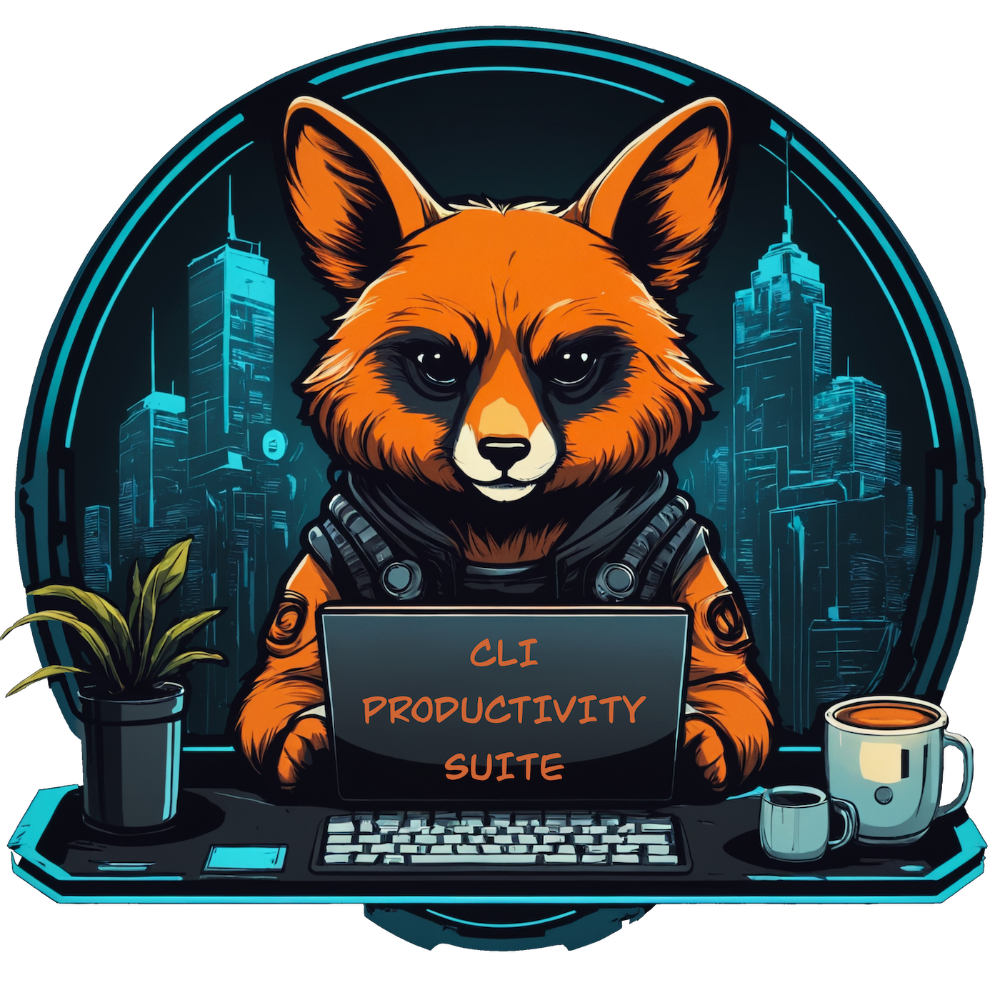

<div align="center">
  
  <h1>CLI Productivity Suite</h1>

  <a href="https://github.com/tanq16/cli-productivity-suite/actions/workflows/release.yaml"></a>&nbsp;<a href="https://github.com/tanq16/cli-productivity-suite/releases"></a><br><br>

  <a href="#capabilities">Capabilities</a> &bull; <a href="#prerequisites">Prerequisites</a> &bull; <a href="#install">Install</a> &bull; <a href="#usage">Usage</a> &bull; <a href="#shell-integration">Shell Integration</a> &bull; <a href="#tips--notes">Tips &amp; Notes</a> &bull; <a href="#sandbox-container">Sandbox Container</a> &bull; <a href="#deep-removal">Deep Removal</a>
</div>

---

A single Go binary (`cps`) that sets up and manages a complete CLI development environment on **Linux** and **macOS**. Run `cps init` once to get a working shell with core tools, Neovim, tmux, and configs. Extend it with `cps extend` for language runtimes, cloud CLIs, security tools, and more.

## Capabilities

| Category | Commands | Description |
|----------|----------|-------------|
| Environment | `init` | Base shell setup — zsh plugins, Neovim + NvChad, tmux + TPM, kitty and shell configs |
| Extensions | `extend <pack>`, `extend <pack> <tool>`, `extend list` | Install tool packs or individual tools — CLI binaries, language runtimes, cloud CLIs, security tooling, self-hosted services |
| Reference | `cheat <topic>` | Terminal cheat sheets for `cps`, Go, Java, uv, fnm, bun, Rust, tmux, nvim, fzf, jq, regex |
| Maintenance | `self-update` | Update the `cps` binary in place |

## Prerequisites

### Bootstrap

macOS ships zsh and curl out of the box; `git` comes from the Xcode Command Line Tools, so install those first if you haven't already:

```bash
xcode-select --install
```

On Linux:

```bash
sudo apt install git curl zsh build-essential
```

### Install this (both platforms)

| Requirement | One-line install |
|---|---|
| [Homebrew](https://brew.sh/) | `/bin/bash -c "$(curl -fsSL https://raw.githubusercontent.com/Homebrew/install/HEAD/install.sh)"` |

Homebrew is required — `cps init` won't run without it. CPS uses brew for all system and cloud CLI packages. CPS does **not** use Oh My Zsh; the two zsh plugins it installs (`zsh-autosuggestions`, `zsh-syntax-highlighting`) are sourced directly from `~/shell/plugins/`.

**Recommended:**

- [Kitty](https://sw.kovidgoyal.net/kitty/) terminal — CPS deploys a Kitty config and Catppuccin theme. Without Kitty, those config files are harmless but unused.
- [JetBrains Mono Nerd Font](https://www.nerdfonts.com/font-downloads) — the Kitty and Neovim configs expect a nerd font. Without one, icons and glyphs will render as boxes.

## Install

```bash
ARCH=$(uname -m); [ "$ARCH" = "x86_64" ] && ARCH=amd64; [ "$ARCH" = "aarch64" ] && ARCH=arm64
mkdir -p "$HOME/.local/bin"
curl -sL "https://github.com/tanq16/cli-productivity-suite/releases/latest/download/cps-$(uname -s | tr '[:upper:]' '[:lower:]')-$ARCH" -o "$HOME/.local/bin/cps"
chmod +x "$HOME/.local/bin/cps"
```

If `~/.local/bin` isn't on your PATH yet (common on fresh macOS), run `cps init` via its full path — `~/.local/bin/cps init` — for the first invocation. The rc fragment that `init` deploys adds `~/.local/bin` to PATH for all future sessions.

Or build from source:

```bash
git clone https://github.com/tanq16/cli-productivity-suite && cd cli-productivity-suite
make build   # produces ./cps
```

## Usage

### Standard setup — run these three commands in order

```bash
cps init                  # base shell env, zsh plugins, configs, neovim, tmux
cps extend essentials     # everyday CLI binaries (bat, fd, ripgrep, fzf, starship, ...)
cps extend core           # dev/network/media brew packages (cmake, nmap, ffmpeg, aerospace)
```

> **Order matters.** `init` deploys `~/.zshrc` and rc fragments that reference binaries (`lsd`, `fd`, `bat`, `fzf`, `starship`, etc.) which the `essentials` pack provides. The shell still works without `essentials`, but aliases like `tree`/`l`/`la` and the starship prompt won't resolve until it's installed. Always follow `init` with `cps extend essentials`.

### `cps init`

Sets up the base shell environment — Homebrew packages (`wget`, `zip`, `unzip`, `file`, `tmux`, `htop`, `neovim`), Neovim with NvChad, zsh plugins (autosuggestions, syntax-highlighting), tmux with TPM, and CPS-managed config files (`.zshrc`, `.tmux.conf`, kitty configs). No CLI binaries are installed here — those live in the `essentials` pack so they can be updated individually. No sudo required.

Everything else via `cps extend` is optional — install what you need.

> **Pack ordering for runtime-backed extensions.** A few tools install *through* a runtime rather than downloading a binary, so they need `cps extend runtimes` first. `cps extend list` marks each one `(needs runtimes)`. The npm-backed CLIs (`claude-code`, `codex`) need fnm's node on PATH — install `runtimes`, then re-source your shell (or open a new one) so `fnm env` has run, otherwise CPS reports `npm install <pkg> failed`. The uv-backed Python CLIs (`prowler`, `oci-cli`) resolve `uv` automatically once it is installed. Everything else, including `antigravity` and `cursor-agent`, downloads a standalone binary and has no runtime dependency.

### `cps extend <pack> [tools...]`

Install extension packs or pick specific tools from a pack.

```bash
cps extend list                       # list all packs
cps extend runtimes                   # install all language runtimes
cps extend runtimes go-sdk            # install only Go
cps extend security nuclei subfinder  # pick specific tools
```

| Pack | Contents |
|---|---|
| essentials | Everyday CLI binaries (bat, fd, ripgrep, lsd, jq, yq, fzf, gh, gron, zoxide, sd, starship, anbu, danzo) + starship.toml |
| core | Dev tools, network utils, media packages (cmake, nmap, ffmpeg, aerospace) |
| runtimes | uv, fnm, bun, Go, Java (Temurin LTS), Python (via uv), Rust, Node.js LTS (via fnm) |
| cloud | AWS CLI, Azure CLI, gcloud CLI |
| security | nuclei, naabu, subfinder, proxify, httpx, dnsx, trufflehog, nuclei-templates |
| cloudsec | terraform, kubectl, kubelogin, grpcurl, trivy, tofu, prowler¹, oci-cli¹ |
| appsec | katana, ffuf, dalfox, gobuster, gau |
| misc | gowitness, age, sq |
| private | Personal tools — public subset (`nits`, `gcli`, `box`, `claudex`) installs as-is; the truly-private two (`toon`, `cybernest`) need `--gh-token` |
| ai-tools | AI coding agents (antigravity, cursor-agent, claude-code¹, codex¹) |
| homelab | Self-hosted services (caddy, linksnapper, kairo, raikiri, expenseowl) + app bundles (rinnegan, code-server) |

¹ Needs `cps extend runtimes` first — `cps extend list` marks these as `(needs runtimes)`.

Packs with shell integration (`runtimes`, `cloud`, `security`) deploy RC fragments automatically.

### `cps cheat <topic>`

Terminal cheat sheets — `cps`, `go`, `java`, `uv`, `fnm`, `bun`, `rust`, `tmux`, `nvim`, `fzf`, `jq`, `regex`.

### `cps self-update`

Updates the `cps` binary in place (at whatever path it's running from).

### Flags

| Flag | Description |
|---|---|
| `--gh-token` | GitHub PAT for private repos (falls back to `gh auth token`) |
| `--debug` | Verbose debug logging |
| `--for-ai` | AI-friendly output (no color) |

## Shell Integration

CPS uses a modular fragment system instead of a monolithic `.zshrc`:

| Fragment | Deployed by |
|---|---|
| `~/shell/rc/00-base.zsh` | `cps init` |
| `~/shell/rc/10-runtimes.zsh` | `cps extend runtimes` |
| `~/shell/rc/20-cloud.zsh` | `cps extend cloud` |
| `~/shell/rc/30-security.zsh` | `cps extend security` |
| `~/shell/rc/custom/*.zsh` | User-managed |

`~/.zshrc` is a thin loader that sources all fragments in order.

### Adding your own stuff (no extension pack needed)

Two drop-zones, two buckets — personal tweaks never need to go through `cps extend`:

| You want to add… | Drop it here | Notes |
|---|---|---|
| Aliases, exports, functions, custom sourcing | `~/shell/rc/custom/anything.zsh` | Loaded automatically by `~/.zshrc` after CPS fragments — so it can override CPS-set values |
| Your own binaries / scripts | `~/shell/custom-bin/` | Prepended to PATH **ahead of** CPS-managed dirs, so your binary wins if a name collides with a CPS one |

Both `~/shell/rc/custom/` and `~/shell/custom-bin/` are created by `cps init` and are **never touched** by subsequent `cps init` / `cps extend` runs.

`deep-removal.sh` wipes the whole `~/shell/` tree, so anything you drop there is removed by it — if you want long-term-survival storage, keep it elsewhere.

## Tips & Notes

- CPS-installed binaries all land in `~/shell/extensions/` (on PATH)
- User-owned binaries live in `~/shell/custom-bin/` (also on PATH, prepended ahead of the CPS-managed dirs, so yours wins on a name collision)
- Self-contained app bundles (`rinnegan`, `code-server`) unpack to `~/shell/apps/<name>/` instead — they are multi-file trees with their own bundled Node runtime, not single binaries, so they are **not** on PATH. Launch them by full path, e.g. `~/shell/apps/rinnegan/bin/rinnegan serve`
- State tracked in `~/.config/cps/state.json` — runs are idempotent, already-current tools are skipped
- If `gh` CLI is authenticated, CPS uses its token automatically — no need for `--gh-token`
- `00-base.zsh` exports `HOMEBREW_NO_AUTO_UPDATE=1` so `brew install` stays fast and deterministic. If you want brew to auto-update on every invocation, drop `unset HOMEBREW_NO_AUTO_UPDATE` into a file under `~/shell/rc/custom/`

## Sandbox Container

A prebuilt Ubuntu container with the full CPS environment baked in — every built-in extension pack (except `private`), brew on Linuxbrew, a non-root `cps` user with sudo, and zsh + tmux + neovim ready to go. Useful when you need a CPS-style workspace on a machine where you can't (or don't want to) install CPS directly.

```bash
docker run -d --name cps-sandbox tanq16/cps-sandbox:latest
docker exec -it cps-sandbox zsh -l
```

The image runs `sleep infinity` as its default command, so it stays alive and you `docker exec` in whenever you need it. `docker exec -it <name> zsh -l` always gives you the full configured shell (rc fragments sourced, PATH wired up, starship prompt, plugins loaded). Inside the shell, `tt` starts a tmux session, `t` re-attaches.

Build locally:

```bash
docker build -t cps-sandbox .
docker run -d --name cps-sandbox cps-sandbox
docker exec -it cps-sandbox zsh -l
```

The image is multi-arch (`linux/amd64` + `linux/arm64`) and large (multi-GB) — it carries full language runtimes, cloud CLIs, security tooling, the `ai-tools` and `homelab` packs, and the public-repo tools from the `private` pack (`nits`, `gcli`, `box`, `claudex`). The two truly-private tools (`toon`, `cybernest`) are skipped since they need an auth token.

### A ready environment for AI agents

The prebuilt image is intentionally a **drop-in toolkit for AI coding agents** — Claude Code, Codex, Cursor, antigravity, and friends. Spin up the container once and a single non-root user already has:

- **The agent CLIs themselves** — `claude`, `codex`, `cursor-agent`, `agy` (antigravity) (the `ai-tools` pack is pre-installed)
- **Language runtimes the agent will reach for** — Go, Node (via fnm), Bun, Python (via uv), Rust, Java (Temurin LTS), all on PATH with no further setup
- **Everyday CLI building blocks** — bat, fd, ripgrep, lsd, jq, yq, fzf, gh, zoxide, gron, sd, starship, plus tmux + neovim
- **Cloud + security tooling** — aws/azure/gcloud CLIs, kubectl, terraform, trivy, nuclei, httpx, dnsx, subfinder, ffuf, katana, and the rest of the security/cloudsec/appsec packs
- **Sandbox isolation** — everything runs as the non-root `cps` user inside a disposable container; `sudo` is available for ad-hoc package installs without polluting your host

```bash
docker run -d --name agent-sandbox tanq16/cps-sandbox:latest
docker exec -it agent-sandbox zsh -l
# inside the container:
claude   # or codex, cursor-agent, agy, ...
```

This is the use case the image is tuned for: an agent (or a human delegating to one) lands in a shell where every tool it's likely to invoke — for code, search, package management, cloud ops, scanning, or recon — is already on PATH. No `brew install` round-trips, no runtime bootstrapping, no "let me set up your environment first." For ephemeral runs, add `--rm` to `docker run`; for sessions you want to come back to, keep the container around and re-`exec` in.

## Deep Removal

Run the included script to wipe CPS and CPS-installed brew packages (plus a legacy `~/.oh-my-zsh` directory if one is left over from pre-v1.x CPS). Homebrew itself and `~/.zsh_history` are preserved so you can reinstall cleanly without rebuilding your shell history or re-bootstrapping brew.

```bash
./deep-removal.sh
```
